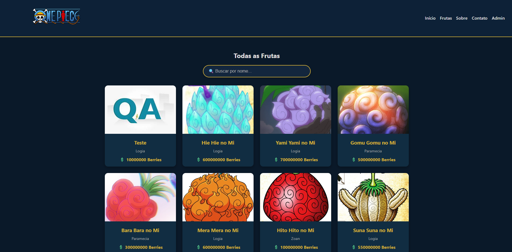

# 🍈 OAT - Akuma no Mi

  
  
  

  Catálogo interativo de <strong>Akuma no Mi</strong> inspirado no universo de <strong>One Piece</strong>, desenvolvido como projeto acadêmico para a disciplina de Programação para Web II.

---

## Funcionalidades principais 
- Navegação SPA baseada em hash (#/), com rotas para: 
- Início 
- Frutas 
- Sobre 
- Contato 
- Admin 
- Catálogo de frutas Akuma no Mi com busca dinâmica. 
- Exibição de cards com imagem, tipo e preço em Berries (Moeda do anime). 
- Autenticação de administrador usando Supabase. 
- Painel administrativo acessível após login.

---

## 🌐 Acesse o Projeto

🔗 **Aplicação Online:**  
Link: [Catalógo AkumaNoMi](https://oat-akumanomi.netlify.app/)

---

## 📸 Preview

## Meu Portfólio
🔗 Link: [HENRICK BORBA](https://henrick-brb.github.io/Portfolio-Profissional/)